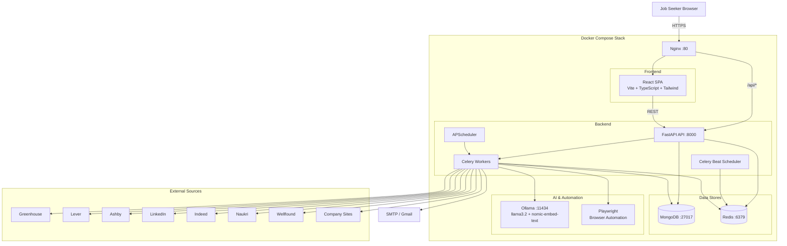
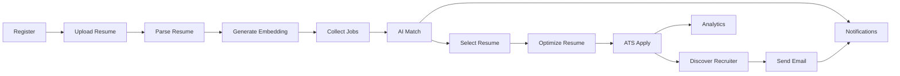
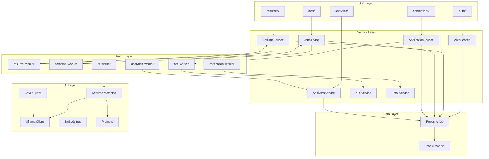
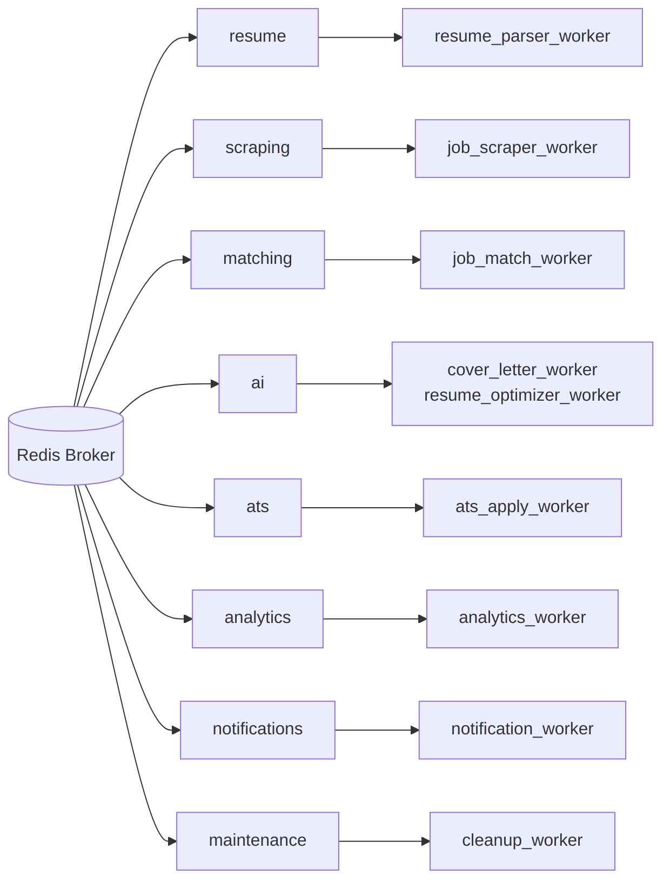

# Architecture Diagram — AI Job Agent

**Version**: 0.1.0  
**Last Updated**: 2026-07-10

> Export this diagram to `ARCHITECTURE.png` for the docs folder. Use Mermaid Live Editor or `mmdc` CLI.

---

## System Context

---

## Pipeline Flow

---

## Backend Layer Architecture

---

## Celery Queue Topology

---

## Revision History

| Version | Date | Changes |
|---------|------|---------|
| 0.1.0 | 2026-07-10 | Initial architecture diagrams |
