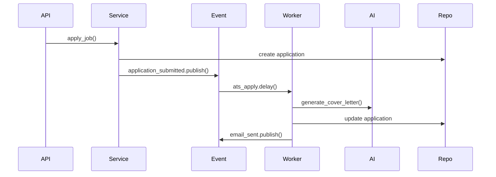

# Layer Responsibilities — AI Job Agent

**Version**: 0.2.0  
**Last Updated**: 2026-07-10

> Every folder has **exactly one responsibility**. Violating this breaks SaaS scalability. This document is enforced by Cursor rules and must be read before any code change.

---

## Why This Architecture

If this project becomes a **SaaS with 10,000 users**, you will not redesign it because:

- Each concern is **isolated** — scale workers independently
- New job sources plug into `collectors/` only
- New AI providers plug into `ai/` only
- Business rules live in one place (`services/`)
- Data access is centralized (`repositories/`)
- Async work never blocks HTTP (`workers/`)
- Scheduling is declarative (`scheduler/` → triggers workers)
- Cross-module communication uses **events**, not direct service-to-service calls

---

## Folder Contract

### `collectors/` — Job Collection ONLY

| ✅ Allowed | ❌ Forbidden |
|-----------|-------------|
| Scrape job boards | Parse resumes |
| Return `RawJob` dataclass | Send emails |
| Rate limiting per source | Write to MongoDB directly |
| Read `configs/job_sources.yaml` | Call AI / Ollama |
| | Call Playwright |
| | Business logic |

```
collectors/greenhouse/ → list[RawJob] → returned to worker
```

---

### `ai/` — AI ONLY

| ✅ Allowed | ❌ Forbidden |
|-----------|-------------|
| Ollama client calls | Database access |
| Prompt loading | HTTP / API routes |
| Embedding generation | Celery task definitions |
| LLM text generation | Business decisions |
| Return plain data structures | Send emails |

```
ai/resume_matching/ → score: float, explanation: str
ai/cover_letter/    → letter: str
```

AI modules receive input, return output. **Workers** persist results via **repositories**.

---

### `services/` — Business Logic ONLY

| ✅ Allowed | ❌ Forbidden |
|-----------|-------------|
| Orchestrate use cases | Direct MongoDB queries |
| Validate business rules | Direct Ollama calls |
| Call repositories | Playwright browser control |
| Publish events (not call workers) | HTTP request/response handling |
| Enqueue via event publishers | Scraping logic |

**Example: Apply Job**

```
ApplicationService.apply(job_id, user_id)
  ↓
1. Validate user owns application, status allows apply
  ↓
2. ResumeService.get_optimized_resume()  (or trigger via event)
  ↓
3. ApplicationRepository.create() / update()
  ↓
4. ApplicationHistoryRepository.log("apply_requested")
  ↓
5. events.application_submitted.publish(application_id)
     → ats_apply worker reacts
```

Services **never** call `worker.delay()` directly. They publish events.

---

### `workers/` — Background Processing ONLY

| ✅ Allowed | ❌ Forbidden |
|-----------|-------------|
| Celery task definitions | Synchronous HTTP |
| Call services, ai, collectors | API route logic |
| Consume event-triggered tasks | Direct user-facing responses |
| Retry / error handling | Scheduling cron definitions |

Workers are **async processors**. Nothing in workers blocks an API request.

| Worker | File | Responsibility |
|--------|------|----------------|
| `resume_parser` | `workers/resume_parser.py` | Parse PDF, call ai/, persist via repo |
| `job_scraper` | `workers/job_scraper.py` | Run collectors, persist jobs |
| `job_matcher` | `workers/job_matcher.py` | Score jobs via ai/, create applications |
| `resume_optimizer` | `workers/resume_optimizer.py` | Optimize resume via ai/ |
| `cover_letter` | `workers/cover_letter.py` | Generate cover letter via ai/ |
| `ats_apply` | `workers/ats_apply.py` | Playwright apply (via ats service) |
| `recruiter_email` | `workers/recruiter_email.py` | Generate + send recruiter email |
| `analytics` | `workers/analytics.py` | Aggregate metrics |
| `notification` | `workers/notification.py` | Create + deliver notifications |
| `cleanup` | `workers/cleanup.py` | Purge stale data |

---

### `scheduler/` — Scheduling ONLY

| ✅ Allowed | ❌ Forbidden |
|-----------|-------------|
| Cron definitions | Scraping logic |
| Trigger worker tasks | Business logic |
| Log to scheduler_logs | Direct DB writes (except logs) |
| Read `configs/scheduler.yaml` | AI calls |

```
Every hour → enqueue job_scraper.collect_jobs
Every 30m  → enqueue job_matcher.score_all
9 AM daily → enqueue ats_apply.process_queue
10 AM daily → enqueue recruiter_email.process_queue
```

Scheduler **only fires triggers**. Workers do the work.

---

### `repositories/` — MongoDB Access ONLY

| ✅ Allowed | ❌ Forbidden |
|-----------|-------------|
| CRUD on Beanie models | AI / Ollama |
| Queries and indexes | Playwright |
| Bulk upsert | HTTP |
| Return Document instances | Business validation |
| | Event publishing |

One repository per collection (or aggregate). **19 collections → 19 repositories**.

---

### `events/` — Event Publishing ONLY

| ✅ Allowed | ❌ Forbidden |
|-----------|-------------|
| Define event payloads | Business logic |
| Publish to Celery queues | Database access |
| Map event → worker task | HTTP handling |
| Typed event dataclasses | AI calls |

Services publish events. Workers subscribe. **No service-to-service chains.**

| Event File | Published By | Triggers Worker |
|------------|--------------|-----------------|
| `resume_uploaded.py` | ResumeService | `resume_parser` |
| `jobs_collected.py` | JobService (via worker) | `job_matcher` |
| `job_matched.py` | JobMatcher worker | `notification` |
| `application_submitted.py` | ApplicationService | `ats_apply` |
| `email_sent.py` | RecruiterService | `analytics`, `notification` |

---

### `api/v1/` — HTTP ONLY

Routers validate input, call one service method, return DTO. No business logic.

---

## Communication Pattern

```
❌ WRONG: ServiceA → ServiceB → ServiceC → worker.delay()

✅ RIGHT: Service → Repository → events.publish() → Worker → ai/ + Repository
```



---

## SaaS Scaling Notes

| Component | Scale Strategy |
|-----------|---------------|
| `api` | Horizontal — multiple FastAPI containers behind Nginx |
| `celery-worker` | Horizontal — `--scale celery-worker=N` per queue |
| `job_scraper` | Dedicated workers per source at scale |
| `ats_apply` | Limited concurrency (Playwright); queue-based |
| `mongodb` | Replica set → sharding at 10k+ users |
| `redis` | Redis Cluster for broker at scale |
| `ollama` | GPU nodes; model routing in `ai/ollama/` |

---

## Revision History

| Version | Date | Changes |
|---------|------|---------|
| 0.1.0 | 2026-07-10 | Initial layer rules |
| 0.2.0 | 2026-07-10 | Strict SRP, events module, 18 collections, worker rename |
| 0.3.0 | 2026-10-01 | `job_matches` is the resume-scoped match cache |
